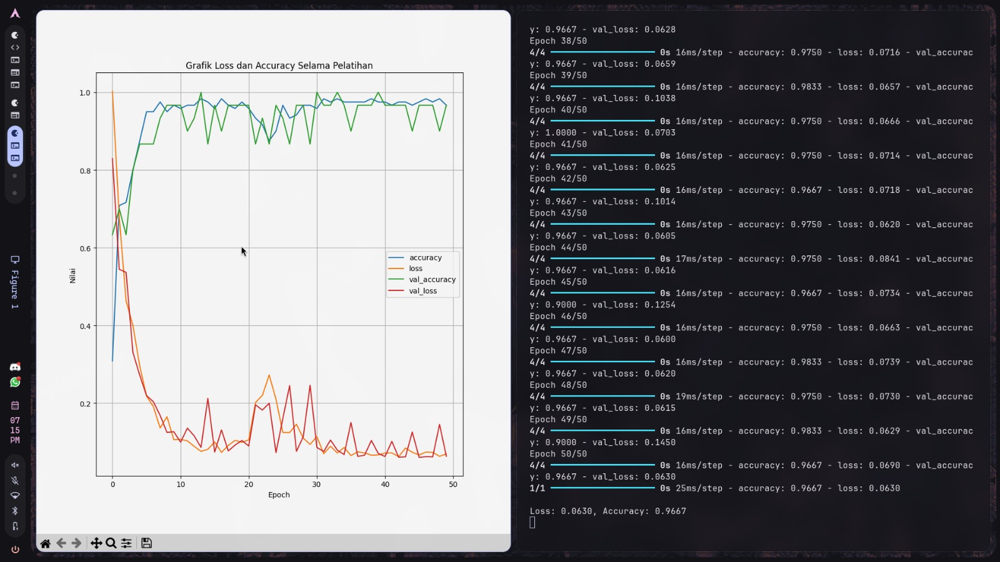
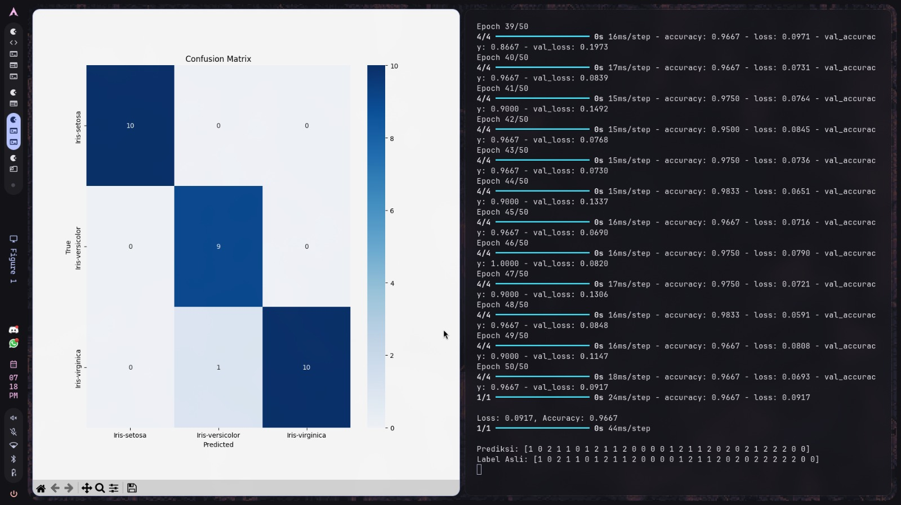

# H1D024102-PraktikumKB-Pertemuan7

Pengumpulan tugas praktikum Kecerdasan Buatan pertemuan 7.

## Klasifikasi Spesies Bunga Iris menggunakan Jaringan Syaraf Tiruan (JST)

Program ini merupakan implementasi Jaringan Syaraf Tiruan (JST) menggunakan **TensorFlow** dan **Keras** untuk mengklasifikasikan spesies bunga Iris berdasarkan fitur morfologinya. Dataset yang digunakan adalah `iris.data` yang dimuat secara lokal.

---

### 1. Library yang Digunakan

Library yang digunakan pada program ini adalah:

**a. `numpy`**
Digunakan untuk membuat dan memanipulasi array numerik, termasuk menyusun data input baru saat prediksi. Import library `numpy` terletak pada **baris ke-8**.

**b. `pandas`**
Digunakan untuk memuat dataset dari file CSV (`iris.data`) dan memvisualisasikan grafik history pelatihan. Import library `pandas` terletak pada **baris ke-9**.

**c. `matplotlib`**
Digunakan untuk menampilkan grafik perubahan loss dan accuracy selama pelatihan. Import library `matplotlib` terletak pada **baris ke-10**.

**d. `seaborn`**
Digunakan untuk memvisualisasikan confusion matrix dalam bentuk heatmap. Import library `seaborn` terletak pada **baris ke-11**.

**e. `tensorflow` & `keras`**
Merupakan library utama untuk membangun, melatih, dan mengevaluasi model neural network. Import dilakukan pada **baris ke-12 sampai 14**.

**f. `sklearn`**
Digunakan untuk tiga keperluan:
- `LabelEncoder` — mengonversi label string menjadi numerik (baris ke-15).
- `train_test_split` — membagi dataset menjadi data latih dan data uji (baris ke-16).
- `confusion_matrix` — menghitung confusion matrix hasil prediksi (baris ke-17).

---

### 2. Dataset

Dataset Iris dimuat dari file lokal `iris.data` pada **baris ke-20**. Dataset ini terdiri dari **150 sampel** dengan:
- **4 fitur input**: sepal length, sepal width, petal length, petal width.
- **1 label output**: spesies bunga (Iris-setosa, Iris-versicolor, Iris-virginica).

Pemisahan fitur dan label dilakukan pada **baris ke-23 dan 24**:
- `X` — 4 kolom pertama sebagai fitur.
- `y` — kolom terakhir sebagai label.

---

### 3. Preprocessing Data

**a. Label Encoding** (baris ke-28 sampai 29)
Label string dikonversi menjadi numerik menggunakan `LabelEncoder`:
- `Iris-setosa` → `0`
- `Iris-versicolor` → `1`
- `Iris-virginica` → `2`

**b. Train-Test Split** (baris ke-32 sampai 34)
Dataset dibagi dengan rasio **80:20**:
- Data latih (`X_train`, `y_train`) — 80% dari total data.
- Data uji (`X_test`, `y_test`) — 20% dari total data.
- `random_state=42` digunakan agar pembagian bersifat reproducible.

---

### 4. Arsitektur Model Neural Network

Model dibangun menggunakan `Sequential` pada **baris ke-38 sampai 44** dengan arsitektur sebagai berikut:

| Layer | Tipe | Neuron | Aktivasi |
|---|---|---|---|
| Input | Input | 4 | — |
| Hidden 1 | Dense | 1000 | ReLU |
| Hidden 2 | Dense | 500 | ReLU |
| Hidden 3 | Dense | 300 | ReLU |
| Output | Dense | 3 | Softmax |

- **ReLU** digunakan pada hidden layer untuk menambahkan non-linearitas.
- **Softmax** digunakan pada output layer karena ini merupakan masalah klasifikasi multikelas (3 kelas).
- Ringkasan arsitektur ditampilkan menggunakan `model.summary()` pada **baris ke-47**.

---

### 5. Kompilasi Model

Kompilasi model dilakukan pada **baris ke-51 sampai 55** dengan konfigurasi:
- **Optimizer**: `adam` — metode adaptif untuk memperbarui bobot model.
- **Loss**: `sparse_categorical_crossentropy` — digunakan karena label berupa integer (bukan one-hot encoding).
- **Metrics**: `accuracy` — metrik yang dipantau selama pelatihan dan evaluasi.

---

### 6. Pelatihan Model

Model dilatih pada **baris ke-58 sampai 63** dengan parameter:
- **Epochs**: 50 — model dilatih sebanyak 50 putaran.
- **Batch size**: 32 — jumlah sampel yang diproses setiap iterasi.
- **Validation data**: `(X_test, y_test)` — data uji digunakan untuk memantau performa model di setiap epoch.

Hasil pelatihan disimpan dalam variabel `history` untuk keperluan visualisasi.

---

### 7. Evaluasi Model

Evaluasi dilakukan pada **baris ke-66 sampai 67** menggunakan `model.evaluate()` pada data uji. Program menampilkan nilai **loss** dan **accuracy** akhir setelah pelatihan selesai.

---

### 8. Visualisasi Grafik Pelatihan

Pada **baris ke-70 sampai 75**, program menampilkan grafik perubahan `loss`, `val_loss`, `accuracy`, dan `val_accuracy` dari epoch ke epoch menggunakan `pd.DataFrame(history.history).plot()`. Grafik ini berguna untuk memantau apakah model mengalami overfitting atau underfitting.

---

### 9. Prediksi dan Confusion Matrix

**a. Prediksi Data Uji** (baris ke-78 sampai 84)
Model melakukan prediksi pada seluruh data uji. Karena output layer menggunakan softmax, `predictions.argmax(axis=1)` digunakan untuk mengambil indeks kelas dengan probabilitas tertinggi sebagai hasil prediksi akhir.

**b. Confusion Matrix** (baris ke-87 sampai 100)
Confusion matrix divisualisasikan menggunakan `seaborn.heatmap()`. Matriks ini menampilkan perbandingan antara label asli (baris) dan hasil prediksi (kolom), sehingga memudahkan identifikasi performa model pada setiap kelas spesies.

---

### 10. Prediksi Data Input Baru

Fungsi `predict_new_data()` pada **baris ke-103 sampai 118** memungkinkan pengguna memasukkan data pengukuran bunga secara manual melalui terminal, lalu model akan memprediksi spesies bunganya. Hasil prediksi numerik dikonversi kembali ke label asli menggunakan `label_encoder.inverse_transform()`.

---

### 11. Cara Menjalankan Program

```bash
# Install dependencies
pip install tensorflow numpy pandas matplotlib seaborn scikit-learn

# Pastikan file iris.data berada di direktori yang sama dengan main.py
# Jalankan program
python main.py
```

---

### 12. Output Program

**a. Grafik Loss dan Accuracy Selama Pelatihan**

Grafik ini menampilkan perubahan nilai `loss`, `val_loss`, `accuracy`, dan `val_accuracy` dari epoch ke epoch. Digunakan untuk memantau apakah model konvergen dengan baik atau mengalami overfitting.



---

**b. Confusion Matrix**

Confusion matrix menampilkan perbandingan antara label asli (baris) dan hasil prediksi model (kolom) untuk setiap kelas spesies bunga Iris. Nilai diagonal menunjukkan prediksi yang benar.



